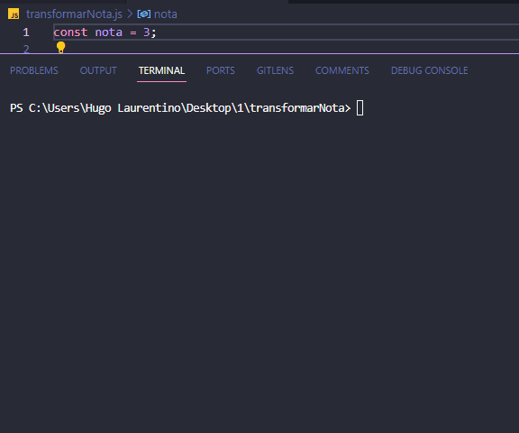

<h1 align="center">
  
</h1>

- [x] Bak-End
- [x] Criar Título
- [x] Criar Descrição
- [x] Sobre
- [x] Tecnologia
- [x] Pre requisito
- [x] Autor
- [x] GIF‘s

---
<h1 align='center'>Transformar nota em conceito</h1>

<p align='center'>Esse é um exemplo de lógica em javascript</p>
<p align='center'>
 Num colégio está sendo feita uma migração de notas (que variam de 0 a 10) para conceitos (que variam de A até E).
</p>

<p align='center'>
 <a href='#sobre'>Sobre</a> |
 <a href='#pré-requisitos'>Pre Requisitos</a> |
 <a href='#tecnologias'>Tecnologias</a> |
 <a href='#autor'>Autor</a>
</p>

---
<h1 align='center'>
 
</h1>

---

### Sobre

  <p align= 'justify'>
    Para não perder o histórico de alunos antigos e mantê-lo condizente com a nova forma conceitual de avaliar, você deve fazer um programa que transforma uma nota em conceito, de acordo com a seguinte tabela:

| Nota        | Conceito |
| ----------- | -------- |
| 9 a 10      | A        |
| 8 a 8,9     | B        |
| 6 a 7,9     | C        |
| 4 a 5,9     | D        |
| menos que 4 | E        |
  </p>

---

### Pré-requisitos

Antes de começar, você vai precisar ter instalado em sua máquina as seguintes FERRAMENTAS: [GIT](https://git-scm.com/), [Node.js](https://nodejs.org/en/download).
Além disto é bom ter um editor para trabalhar com o código como [VSCode](https://code.visualstudio.com/download).

### 🎲 Rodando o Back End

```bash
# Clone este repositório
$ git clone https://github.com/hugolaurentino/transformarNota.git

# Acesse a pasta do projeto no terminal/cmd
$ cd transformarNota

# Instale as dependências
$ npm install

# Execute 
$ node .\transformarNota.js

```
### Tecnologias

As seguintes ferramentas foram usadas na construção do projeto:

- [Node.js][nodejs]

---
###### tags: `lógica` `matemática` `nodeJS`
## Autor
Feito com ❤️ por Hugo Laurentino 👋🏽 [Entre em contato!](https://www.linkedin.com/in/hugo-laurentino-silva/)

[nodejs]: https://nodejs.org/
